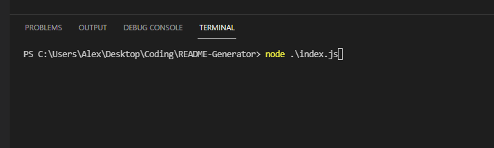
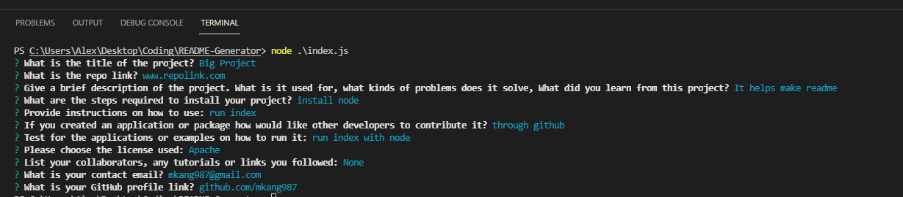
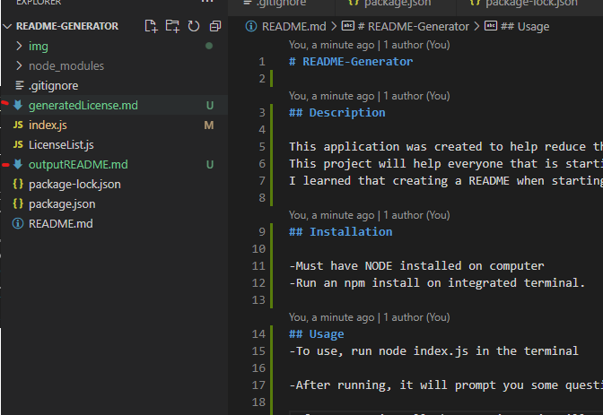

# README-Generator

## Description

This application was created to help reduce the time to create a professional README.
This project will help everyone that is starting a new career in programing have a base foundation on how a README should look like.
I learned that creating a README when starting out can be confusing on what type of information is needed and the formatting.

## Installation

-Must have NODE installed on computer
-Run an npm install on integrated terminal.

## Usage
-To use, run node index.js in the terminal

-After running, it will prompt you some questions about your application

-After answering all the questions, it will generate 2 files. A license information and a generated README.

## Links
Link to repo: https://github.com/mkang987/README-Generator

Link to quick video walkthrough: https://youtu.be/ISUTG_ggOXQ

## Credits
NPM

## Contacts
Email me at: mkang987@gmail.com

Or check out my github: www.github.com/mkang987